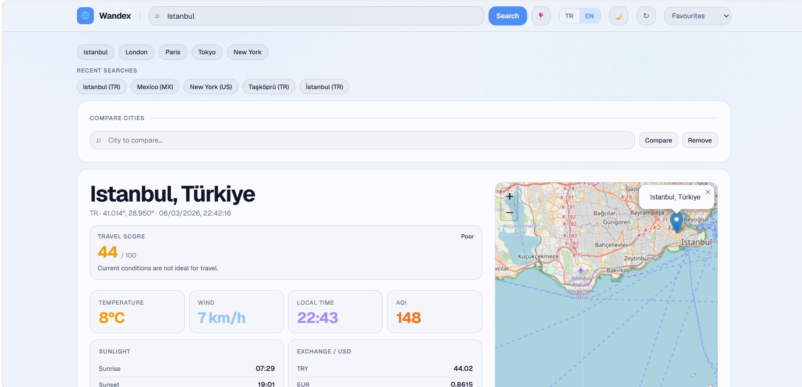

<div align="center">

# 🌍 Wandex

### Smart Travel Dashboard • Real-Time Data • Interactive Map

[](https://YOUR-DEMO-LINK)
[]()
[]()
[]()
[]()

A modern **travel information dashboard** that gathers **real-time data from multiple public APIs** and presents them in a clean interactive interface.

🌐 **Live Demo**
https://berfinida.github.io/Wandex/

</div>

---

# ✨ Overview

**Wandex** is a smart travel dashboard that allows users to explore cities around the world and instantly access useful travel information.

The application combines multiple real-time data sources to provide:

• weather conditions
• air quality information
• sunrise and sunset times
• currency exchange rates
• country details
• public holidays
• cryptocurrency prices

All information is displayed through a **clean dashboard interface with an interactive map**.

The goal of this project is to demonstrate how **multiple external APIs can be combined into a single modern web application**.

---

# 🚀 Features

## 🔎 City Search

Users can search for cities worldwide.

The application retrieves city data including:

• location coordinates
• country information
• timezone data

The dashboard updates dynamically when a new city is selected.

---

## 🌤 Weather Dashboard

Real-time weather information is displayed for the selected city.

Includes:

• current temperature
• wind speed
• hourly forecast
• 7-day forecast
• visual temperature trend chart

Weather data is powered by the **Open-Meteo API**.

---

## 🌫 Air Quality Index

The dashboard displays current air quality conditions including:

• AQI level
• pollutant indicators

This helps users quickly understand environmental conditions in the selected city.

---

## 🌅 Sun Information

Sunlight information is provided for the selected location.

Includes:

• sunrise time
• sunset time
• total daylight duration

---

## 🗺 Interactive Map

The selected city is displayed on a **Leaflet interactive map**.

Features include:

• automatic map centering
• location marker
• coordinate display

---

## 💱 Currency Exchange

Live currency rates relative to USD are shown.

Examples include:

• TRY
• EUR
• GBP

---

## 🌍 Country Information

Country-level information is retrieved from **REST Countries API**.

Includes:

• country name
• country code
• location details

---

## 📅 Public Holidays

Displays official public holidays for the selected country using the **Nager.Date API**.

---

## ₿ Crypto Prices

Live cryptocurrency prices are shown using the **CoinGecko API**.

Examples include:

• Bitcoin
• Ethereum

---

## ⭐ Favorites System

Users can save cities as favorites.

Features include:

• quick city switching
• persistent storage using localStorage

---

## 🕓 Recent Searches

The application keeps track of the most recent city searches.

This allows quick navigation between previously viewed locations.

---

## ⚖ City Comparison

Users can compare two cities directly in the dashboard.

Metrics include:

• temperature
• wind speed
• AQI
• daylight duration

---

## 🌙 Light / Dark Mode

The dashboard supports **dynamic theme switching**.

Features include:

• light theme
• dark theme
• system theme detection

---

## 🌐 Multi-language Support

The interface supports multiple languages.

Currently available:

• Turkish
• English

---

# 🖼 Interface Preview


---

# 🛠 Tech Stack

| Technology | Purpose               |
| ---------- | --------------------- |
| HTML5      | Application structure |
| CSS3       | UI styling and layout |
| JavaScript | Application logic     |
| Leaflet.js | Interactive map       |
| Chart.js   | Temperature charts    |

---

# 🔌 Data Sources

The project integrates several public APIs:

| API            | Purpose                 |
| -------------- | ----------------------- |
| Open-Meteo     | Weather data            |
| Sunrise-Sunset | Sun information         |
| REST Countries | Country information     |
| Nager.Date     | Public holidays         |
| open.er-api    | Currency exchange rates |
| CoinGecko      | Cryptocurrency prices   |
| OpenStreetMap  | Map tiles               |

All APIs used in this project **do not require API keys**, making the project lightweight and easy to deploy.

---

# 📂 Project Structure

```
Wandex
│
├── index.html
├── style.css
├── app.js
│
├── assets/
├── preview.png
│
└── README.md
```

---

# 🎯 Project Purpose

This project was created to:

• practice building real-world dashboard applications
• integrate multiple external APIs
• develop a clean interactive user interface
• create a portfolio-ready web application

---

# 🔮 Future Improvements

Possible improvements include:

• weather radar layers on the map
• travel score system
• offline caching
• advanced analytics dashboard
• user accounts and saved trips

---

# 👩‍💻 Developer

**Berfin Nida Öztürk**

GitHub
https://github.com/berfinida

LinkedIn
https://www.linkedin.com/in/berfin-nida-%C3%B6zt%C3%BCrk-6a12131b7/

---

# 📄 License

MIT License
